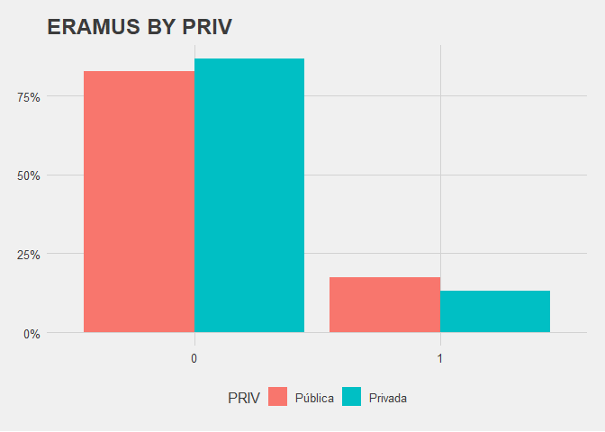

Exploratory Data Analysis (EILU)
================
#### Antonio Tello Gómez


``` r
#Libraries
library(tidyverse)
library(arsenal)
library(polycor)
library(corrplot)
```

``` r
#Import Data
fs <- read.delim("EILU_GRADUADOS/CSV/EILU_GRAD_2019.csv")
fs[,names(fs)] <- lapply(fs[,names(fs)] , factor)
fs$IDENT <- as.numeric(as.character(fs$IDENT))
#str(fs)
```

``` r
#Creating some new variables
fs$ESP <- as.factor(as.integer(fs$NACIO != 3))
fs$EMPLEO <- as.factor(as.integer(fs$TRBPRN1 == 1))
fs$ACT <- as.factor(as.integer(fs$TRBPRN1 != 3))
fs$PRIV <- as.factor((as.integer(fs$T_UNIV )> 2)*1)
fs$INGL <- as.factor(as.numeric(fs$IDI_MT1 == "6" |
                       fs$IDI_MT2 == "6"|
                       fs$IDIOMA1== "6" & (fs$TIPOACREIDI1 == "4" | fs$TIPOACREIDI1 == "5" | fs$TIPOACREIDI1 == "6")|
                       fs$IDIOMA2== "6" & (fs$TIPOACREIDI2 == "4" | fs$TIPOACREIDI1 == "5" | fs$TIPOACREIDI1 == "6")|
                       fs$IDIOMA3== "6" & (fs$TIPOACREIDI3 == "4" | fs$TIPOACREIDI1 == "5" | fs$TIPOACREIDI1 == "6")|
                       fs$IDIOMA4== "6" & (fs$TIPOACREIDI4 == "4" | fs$TIPOACREIDI1 == "5" | fs$TIPOACREIDI1 == "6")))
fs$INGL[is.na(fs$INGL)] <- 0

summary(fs$INGL) #Ingles B2 o superior acreditado
```

    ##     0     1 
    ## 19597 12054

``` r
summary(fs$ESP) #Nacionalidad española 
```

    ##     0     1 
    ##   349 31302

``` r
summary(fs$EMPLEO) #Tiene Empleo 
```

    ##     0     1 
    ##  4527 27124

``` r
summary(fs$ACT) #Activo
```

    ##     0     1 
    ##  2089 29562

``` r
summary(fs$PRIV) #Fue a universidad privada
```

    ##     0     1 
    ## 26978  4673

## Summary Tables

### Distribution of variables by university type

``` r
# 1 Table by type of university (Public/Private)
preVars = PRIV ~ SEXO + EDAD + NACIO + RAMA + AMBITO + DISCA + PAIS_NAC_MADRE +
  PAIS_NAC_PADRE + ESTUDIOS_PADRE + ESTUDIOS_MADRE + BECAg + BECAe + 
  BECAef + ERAMUS + MOTIV + TIC + INGL + 
  CURSOidi + CURSOinf + CURSOotro + PRACTICAS + SITUACION_LAB + ESTADO_CIV + CONVIVE_PAREJA + TR_SUELDO

table_one <- tableby(preVars, data = fs) 
summary(table_one)
```

|                           | Pública (N=26878) | Privada (N=4658) | Total (N=31536) |  p value |
| :------------------------ | :---------------: | :--------------: | :-------------: | -------: |
| **SEXO**                  |                   |                  |                 |    0.009 |
| Hombre                    |   11460 (42.6%)   |   2081 (44.7%)   |  13541 (42.9%)  |          |
| Mujer                     |   15418 (57.4%)   |   2577 (55.3%)   |  17995 (57.1%)  |          |
| **EDAD**                  |                   |                  |                 | \< 0.001 |
| Menos de 30               |   13737 (51.1%)   |   1936 (41.6%)   |  15673 (49.7%)  |          |
| De 30 a 34                |   7649 (28.5%)    |   1123 (24.1%)   |  8772 (27.8%)   |          |
| 35 y más                  |   5492 (20.4%)    |   1599 (34.3%)   |  7091 (22.5%)   |          |
| **NACIO**                 |                   |                  |                 | \< 0.001 |
| Esp                       |   26255 (97.7%)   |   4593 (98.6%)   |  30848 (97.8%)  |          |
| Esp y otra                |    311 (1.2%)     |    31 (0.7%)     |   342 (1.1%)    |          |
| Otra                      |    312 (1.2%)     |    34 (0.7%)     |   346 (1.1%)    |          |
| **RAMA**                  |                   |                  |                 | \< 0.001 |
| Artes y humanidades       |   2983 (11.1%)    |    184 (4.0%)    |  3167 (10.0%)   |          |
| Ciencias                  |    2658 (9.9%)    |    103 (2.2%)    |   2761 (8.8%)   |          |
| CCSS                      |   11751 (43.7%)   |   2712 (58.2%)   |  14463 (45.9%)  |          |
| ingeniería                |   5848 (21.8%)    |   817 (17.5%)    |  6665 (21.1%)   |          |
| C. Salud                  |   3638 (13.5%)    |   842 (18.1%)    |  4480 (14.2%)   |          |
| **AMBITO**                |                   |                  |                 | \< 0.001 |
| Educación                 |    982 (3.7%)     |    77 (1.7%)     |   1059 (3.4%)   |          |
| Artes                     |    860 (3.2%)     |    43 (0.9%)     |   903 (2.9%)    |          |
| Humanidades               |    844 (3.1%)     |    69 (1.5%)     |   913 (2.9%)    |          |
| Lenguas                   |    1092 (4.1%)    |    60 (1.3%)     |   1152 (3.7%)   |          |
| CCSS y del comportamiento |    649 (2.4%)     |    55 (1.2%)     |   704 (2.2%)    |          |
| Peridosimo                |    596 (2.2%)     |    184 (4.0%)    |   780 (2.5%)    |          |
| Negocios y admin          |    661 (2.5%)     |    187 (4.0%)    |   848 (2.7%)    |          |
| Derecho                   |    1413 (5.3%)    |    305 (6.5%)    |   1718 (5.4%)   |          |
| C. de la vida             |    876 (3.3%)     |    62 (1.3%)     |   938 (3.0%)    |          |
| Medio Ambiente            |    470 (1.7%)     |    17 (0.4%)     |   487 (1.5%)    |          |
| C. FyQ                    |    866 (3.2%)     |    18 (0.4%)     |   884 (2.8%)    |          |
| Matemáticas               |    440 (1.6%)     |     0 (0.0%)     |   440 (1.4%)    |          |
| Informatica               |    926 (3.4%)     |    200 (4.3%)    |   1126 (3.6%)   |          |
| Ingeniería                |    2339 (8.7%)    |    259 (5.6%)    |   2598 (8.2%)   |          |
| Industria                 |    540 (2.0%)     |    14 (0.3%)     |   554 (1.8%)    |          |
| Arquitectura              |    1249 (4.6%)    |    285 (6.1%)    |   1534 (4.9%)   |          |
| Agricultura               |    508 (1.9%)     |    31 (0.7%)     |   539 (1.7%)    |          |
| Silvicultura              |    283 (1.1%)     |    18 (0.4%)     |   301 (1.0%)    |          |
| Veterinaria               |    367 (1.4%)     |    54 (1.2%)     |   421 (1.3%)    |          |
| Salud (otros)             |    1065 (4.0%)    |    290 (6.2%)    |   1355 (4.3%)   |          |
| Servicios Sociales        |    714 (2.7%)     |    94 (2.0%)     |   808 (2.6%)    |          |
| Servicos(otros)           |    213 (0.8%)     |     6 (0.1%)     |   219 (0.7%)    |          |
| Enseñanza infantil        |    994 (3.7%)     |    368 (7.9%)    |   1362 (4.3%)   |          |
| Enseñanza Primaria        |    1262 (4.7%)    |   639 (13.7%)    |   1901 (6.0%)   |          |
| Audisovisuales            |    353 (1.3%)     |    172 (3.7%)    |   525 (1.7%)    |          |
| Economía                  |    741 (2.8%)     |    22 (0.5%)     |   763 (2.4%)    |          |
| Psicología                |    848 (3.2%)     |    168 (3.6%)    |   1016 (3.2%)   |          |
| Direccion y admin         |    2091 (7.8%)    |    416 (8.9%)    |   2507 (7.9%)   |          |
| Medicina                  |    696 (2.6%)     |    70 (1.5%)     |   766 (2.4%)    |          |
| Efremería                 |    970 (3.6%)     |    261 (5.6%)    |   1231 (3.9%)   |          |
| C. Actividad Física       |    449 (1.7%)     |    153 (3.3%)    |   602 (1.9%)    |          |
| Turismo                   |    521 (1.9%)     |    61 (1.3%)     |   582 (1.8%)    |          |
| **DISCA**                 |                   |                  |                 |    0.032 |
| 0                         |   26535 (98.7%)   |   4616 (99.1%)   |  31151 (98.8%)  |          |
| 1                         |    343 (1.3%)     |    42 (0.9%)     |   385 (1.2%)    |          |
| **PAIS\_NAC\_MADRE**      |                   |                  |                 | \< 0.001 |
| ESP                       |   25412 (94.5%)   |   4474 (96.0%)   |  29886 (94.8%)  |          |
| UE                        |    401 (1.5%)     |    46 (1.0%)     |   447 (1.4%)    |          |
| No UE                     |    730 (2.7%)     |    87 (1.9%)     |   817 (2.6%)    |          |
| NS/NC                     |    335 (1.2%)     |    51 (1.1%)     |   386 (1.2%)    |          |
| **PAIS\_NAC\_PADRE**      |                   |                  |                 | \< 0.001 |
| ESP                       |   25605 (95.3%)   |   4504 (96.7%)   |  30109 (95.5%)  |          |
| UE                        |    334 (1.2%)     |    37 (0.8%)     |   371 (1.2%)    |          |
| No UE                     |    760 (2.8%)     |    89 (1.9%)     |   849 (2.7%)    |          |
| NS/NC                     |    179 (0.7%)     |    28 (0.6%)     |   207 (0.7%)    |          |
| **ESTUDIOS\_PADRE**       |                   |                  |                 | \< 0.001 |
| Sin Estudios              |     90 (0.3%)     |    22 (0.5%)     |   112 (0.4%)    |          |
| Primaria Incompleta       |    1430 (5.3%)    |    238 (5.1%)    |   1668 (5.3%)   |          |
| Educ. Primaria            |   4636 (17.2%)    |   612 (13.1%)    |  5248 (16.6%)   |          |
| Educ. Secundaria          |   4454 (16.6%)    |   580 (12.5%)    |  5034 (16.0%)   |          |
| Bachillerato              |   3120 (11.6%)    |   480 (10.3%)    |  3600 (11.4%)   |          |
| Grado Medio               |    2115 (7.9%)    |    285 (6.1%)    |   2400 (7.6%)   |          |
| Grado Superior            |    1978 (7.4%)    |    326 (7.0%)    |   2304 (7.3%)   |          |
| Universidad               |   7231 (26.9%)    |   1752 (37.6%)   |  8983 (28.5%)   |          |
| NS/NC                     |    1824 (6.8%)    |    363 (7.8%)    |   2187 (6.9%)   |          |
| **ESTUDIOS\_MADRE**       |                   |                  |                 | \< 0.001 |
| Sin Estudios              |    105 (0.4%)     |    20 (0.4%)     |   125 (0.4%)    |          |
| Primaria Incompleta       |    1380 (5.1%)    |    238 (5.1%)    |   1618 (5.1%)   |          |
| Educ. Primaria            |   4576 (17.0%)    |   707 (15.2%)    |  5283 (16.8%)   |          |
| Educ. Secundaria          |   5128 (19.1%)    |   675 (14.5%)    |  5803 (18.4%)   |          |
| Bachillerato              |   3389 (12.6%)    |   506 (10.9%)    |  3895 (12.4%)   |          |
| Grado Medio               |    2520 (9.4%)    |    366 (7.9%)    |   2886 (9.2%)   |          |
| Grado Superior            |    1594 (5.9%)    |    269 (5.8%)    |   1863 (5.9%)   |          |
| Universidad               |   6994 (26.0%)    |   1615 (34.7%)   |  8609 (27.3%)   |          |
| NS/NC                     |    1192 (4.4%)    |    262 (5.6%)    |   1454 (4.6%)   |          |
| **BECAg**                 |                   |                  |                 | \< 0.001 |
| 0                         |   15450 (57.5%)   |   4041 (86.8%)   |  19491 (61.8%)  |          |
| 1                         |   11428 (42.5%)   |   617 (13.2%)    |  12045 (38.2%)  |          |
| **BECAe**                 |                   |                  |                 |    0.022 |
| 0                         |   25661 (95.5%)   |   4482 (96.2%)   |  30143 (95.6%)  |          |
| 1                         |    1217 (4.5%)    |    176 (3.8%)    |   1393 (4.4%)   |          |
| **BECAef**                |                   |                  |                 | \< 0.001 |
| 0                         |   23771 (88.4%)   |   4428 (95.1%)   |  28199 (89.4%)  |          |
| 1                         |   3107 (11.6%)    |    230 (4.9%)    |  3337 (10.6%)   |          |
| **ERAMUS**                |                   |                  |                 | \< 0.001 |
| 0                         |   22224 (82.7%)   |   4043 (86.8%)   |  26267 (83.3%)  |          |
| 1                         |   4654 (17.3%)    |   615 (13.2%)    |  5269 (16.7%)   |          |
| **MOTIV**                 |                   |                  |                 |    0.002 |
| Otros                     |    2312 (8.6%)    |    461 (9.9%)    |   2773 (8.8%)   |          |
| Laboral                   |   20170 (75.0%)   |   3503 (75.2%)   |  23673 (75.1%)  |          |
| Satisfacción Personal     |   4396 (16.4%)    |   694 (14.9%)    |  5090 (16.1%)   |          |
| **TIC**                   |                   |                  |                 | \< 0.001 |
| Basico                    |   3105 (11.6%)    |   654 (14.0%)    |  3759 (11.9%)   |          |
| Intermedio                |   18124 (67.4%)   |   3048 (65.4%)   |  21172 (67.1%)  |          |
| Avanzado                  |   5613 (20.9%)    |   944 (20.3%)    |  6557 (20.8%)   |          |
| NS/NC                     |     36 (0.1%)     |    12 (0.3%)     |    48 (0.2%)    |          |
| **INGL**                  |                   |                  |                 | \< 0.001 |
| 0                         |   16762 (62.4%)   |   2770 (59.5%)   |  19532 (61.9%)  |          |
| 1                         |   10116 (37.6%)   |   1888 (40.5%)   |  12004 (38.1%)  |          |
| **CURSOidi**              |                   |                  |                 |    0.016 |
| 0                         |   14347 (53.4%)   |   2575 (55.3%)   |  16922 (53.7%)  |          |
| 1                         |   12531 (46.6%)   |   2083 (44.7%)   |  14614 (46.3%)  |          |
| **CURSOinf**              |                   |                  |                 |    0.141 |
| 0                         |   20987 (78.1%)   |   3592 (77.1%)   |  24579 (77.9%)  |          |
| 1                         |   5891 (21.9%)    |   1066 (22.9%)   |  6957 (22.1%)   |          |
| **CURSOotro**             |                   |                  |                 |    0.989 |
| 0                         |   15069 (56.1%)   |   2612 (56.1%)   |  17681 (56.1%)  |          |
| 1                         |   11809 (43.9%)   |   2046 (43.9%)   |  13855 (43.9%)  |          |
| **PRACTICAS**             |                   |                  |                 | \< 0.001 |
| No                        |   7105 (26.4%)    |   1261 (27.1%)   |  8366 (26.5%)   |          |
| Si, curriculares          |   12180 (45.3%)   |   2088 (44.8%)   |  14268 (45.2%)  |          |
| Si, extracurriculares     |   3703 (13.8%)    |   539 (11.6%)    |  4242 (13.5%)   |          |
| Si, ambas                 |   3890 (14.5%)    |   770 (16.5%)    |  4660 (14.8%)   |          |
| **SITUACION\_LAB**        |                   |                  |                 | \< 0.001 |
| Trabajando                |   22834 (85.0%)   |   4196 (90.1%)   |  27030 (85.7%)  |          |
| En desempelo              |    2187 (8.1%)    |    239 (5.1%)    |   2426 (7.7%)   |          |
| Inactivo                  |    1857 (6.9%)    |    223 (4.8%)    |   2080 (6.6%)   |          |
| **ESTADO\_CIV**           |                   |                  |                 | \< 0.001 |
| Soltero                   |   21512 (80.0%)   |   3096 (66.5%)   |  24608 (78.0%)  |          |
| Casado                    |   4864 (18.1%)    |   1400 (30.1%)   |  6264 (19.9%)   |          |
| Viudo                     |     36 (0.1%)     |    12 (0.3%)     |    48 (0.2%)    |          |
| Separado                  |     58 (0.2%)     |    23 (0.5%)     |    81 (0.3%)    |          |
| Divorciado                |    316 (1.2%)     |    103 (2.2%)    |   419 (1.3%)    |          |
| NS/NC                     |     92 (0.3%)     |    24 (0.5%)     |   116 (0.4%)    |          |
| **CONVIVE\_PAREJA**       |                   |                  |                 | \< 0.001 |
| Si                        |   12838 (47.8%)   |   2574 (55.3%)   |  15412 (48.9%)  |          |
| No                        |   13897 (51.7%)   |   2047 (43.9%)   |  15944 (50.6%)  |          |
| NS/NC                     |    143 (0.5%)     |    37 (0.8%)     |   180 (0.6%)    |          |
| **TR\_SUELDO**            |                   |                  |                 | \< 0.001 |
| \<700€                    |    1562 (5.8%)    |    188 (4.0%)    |   1750 (5.5%)   |          |
| De 700 a 999              |    2271 (8.4%)    |    250 (5.4%)    |   2521 (8.0%)   |          |
| de 1000 a 1499            |   7384 (27.5%)    |   1003 (21.5%)   |  8387 (26.6%)   |          |
| De 1500 a 1999            |   6429 (23.9%)    |   1433 (30.8%)   |  7862 (24.9%)   |          |
| De 2000 a 2499            |   2748 (10.2%)    |   684 (14.7%)    |  3432 (10.9%)   |          |
| De 2500 a 2999            |    966 (3.6%)     |    237 (5.1%)    |   1203 (3.8%)   |          |
| \>3000€                   |    888 (3.3%)     |    256 (5.5%)    |   1144 (3.6%)   |          |
| NS/NC                     |    586 (2.2%)     |    145 (3.1%)    |   731 (2.3%)    |          |
| NaN                       |   4044 (15.0%)    |    462 (9.9%)    |  4506 (14.3%)   |          |

### Distribution of variables by employment situation

``` r
# 2 Table by employment situation 
preVars = EMPLEO ~ PRIV + SEXO + EDAD + NACIO + RAMA + AMBITO + DISCA + PAIS_NAC_MADRE +
  PAIS_NAC_PADRE + ESTUDIOS_PADRE + ESTUDIOS_MADRE + BECAg + BECAe + 
  BECAef + ERAMUS + MOTIV + TIC + INGL + 
  CURSOidi + CURSOinf + CURSOotro + PRACTICAS + ESTADO_CIV + CONVIVE_PAREJA

table_two <- tableby(preVars, data = fs) 
summary(table_two)
```

|                           |  0 (N=4506)  |  1 (N=27030)  | Total (N=31536) |  p value |
| :------------------------ | :----------: | :-----------: | :-------------: | -------: |
| **PRIV**                  |              |               |                 | \< 0.001 |
| Pública                   | 4044 (89.7%) | 22834 (84.5%) |  26878 (85.2%)  |          |
| Privada                   | 462 (10.3%)  | 4196 (15.5%)  |  4658 (14.8%)   |          |
| **SEXO**                  |              |               |                 | \< 0.001 |
| Hombre                    | 1753 (38.9%) | 11788 (43.6%) |  13541 (42.9%)  |          |
| Mujer                     | 2753 (61.1%) | 15242 (56.4%) |  17995 (57.1%)  |          |
| **EDAD**                  |              |               |                 | \< 0.001 |
| Menos de 30               | 2374 (52.7%) | 13299 (49.2%) |  15673 (49.7%)  |          |
| De 30 a 34                | 1214 (26.9%) | 7558 (28.0%)  |  8772 (27.8%)   |          |
| 35 y más                  | 918 (20.4%)  | 6173 (22.8%)  |  7091 (22.5%)   |          |
| **NACIO**                 |              |               |                 |    0.749 |
| Esp                       | 4413 (97.9%) | 26435 (97.8%) |  30848 (97.8%)  |          |
| Esp y otra                |  44 (1.0%)   |  298 (1.1%)   |   342 (1.1%)    |          |
| Otra                      |  49 (1.1%)   |  297 (1.1%)   |   346 (1.1%)    |          |
| **RAMA**                  |              |               |                 | \< 0.001 |
| Artes y humanidades       | 789 (17.5%)  |  2378 (8.8%)  |  3167 (10.0%)   |          |
| Ciencias                  |  432 (9.6%)  |  2329 (8.6%)  |   2761 (8.8%)   |          |
| CCSS                      | 2362 (52.4%) | 12101 (44.8%) |  14463 (45.9%)  |          |
| ingeniería                | 537 (11.9%)  | 6128 (22.7%)  |  6665 (21.1%)   |          |
| C. Salud                  |  386 (8.6%)  | 4094 (15.1%)  |  4480 (14.2%)   |          |
| **AMBITO**                |              |               |                 | \< 0.001 |
| Educación                 |  178 (4.0%)  |  881 (3.3%)   |   1059 (3.4%)   |          |
| Artes                     |  248 (5.5%)  |  655 (2.4%)   |   903 (2.9%)    |          |
| Humanidades               |  269 (6.0%)  |  644 (2.4%)   |   913 (2.9%)    |          |
| Lenguas                   |  240 (5.3%)  |  912 (3.4%)   |   1152 (3.7%)   |          |
| CCSS y del comportamiento |  117 (2.6%)  |  587 (2.2%)   |   704 (2.2%)    |          |
| Peridosimo                |  126 (2.8%)  |  654 (2.4%)   |   780 (2.5%)    |          |
| Negocios y admin          |  108 (2.4%)  |  740 (2.7%)   |   848 (2.7%)    |          |
| Derecho                   |  377 (8.4%)  |  1341 (5.0%)  |   1718 (5.4%)   |          |
| C. de la vida             |  168 (3.7%)  |  770 (2.8%)   |   938 (3.0%)    |          |
| Medio Ambiente            |  64 (1.4%)   |  423 (1.6%)   |   487 (1.5%)    |          |
| C. FyQ                    |  148 (3.3%)  |  736 (2.7%)   |   884 (2.8%)    |          |
| Matemáticas               |  53 (1.2%)   |  387 (1.4%)   |   440 (1.4%)    |          |
| Informatica               |  46 (1.0%)   |  1080 (4.0%)  |   1126 (3.6%)   |          |
| Ingeniería                |  176 (3.9%)  |  2422 (9.0%)  |   2598 (8.2%)   |          |
| Industria                 |  67 (1.5%)   |  487 (1.8%)   |   554 (1.8%)    |          |
| Arquitectura              |  151 (3.4%)  |  1383 (5.1%)  |   1534 (4.9%)   |          |
| Agricultura               |  62 (1.4%)   |  477 (1.8%)   |   539 (1.7%)    |          |
| Silvicultura              |  35 (0.8%)   |  266 (1.0%)   |   301 (1.0%)    |          |
| Veterinaria               |  52 (1.2%)   |  369 (1.4%)   |   421 (1.3%)    |          |
| Salud (otros)             |  103 (2.3%)  |  1252 (4.6%)  |   1355 (4.3%)   |          |
| Servicios Sociales        |  101 (2.2%)  |  707 (2.6%)   |   808 (2.6%)    |          |
| Servicos(otros)           |  19 (0.4%)   |  200 (0.7%)   |   219 (0.7%)    |          |
| Enseñanza infantil        |  285 (6.3%)  |  1077 (4.0%)  |   1362 (4.3%)   |          |
| Enseñanza Primaria        |  319 (7.1%)  |  1582 (5.9%)  |   1901 (6.0%)   |          |
| Audisovisuales            |  91 (2.0%)   |  434 (1.6%)   |   525 (1.7%)    |          |
| Economía                  |  97 (2.2%)   |  666 (2.5%)   |   763 (2.4%)    |          |
| Psicología                |  172 (3.8%)  |  844 (3.1%)   |   1016 (3.2%)   |          |
| Direccion y admin         |  321 (7.1%)  |  2186 (8.1%)  |   2507 (7.9%)   |          |
| Medicina                  |  38 (0.8%)   |  728 (2.7%)   |   766 (2.4%)    |          |
| Efremería                 |  84 (1.9%)   |  1147 (4.2%)  |   1231 (3.9%)   |          |
| C. Actividad Física       |  87 (1.9%)   |  515 (1.9%)   |   602 (1.9%)    |          |
| Turismo                   |  104 (2.3%)  |  478 (1.8%)   |   582 (1.8%)    |          |
| **DISCA**                 |              |               |                 | \< 0.001 |
| 0                         | 4405 (97.8%) | 26746 (98.9%) |  31151 (98.8%)  |          |
| 1                         |  101 (2.2%)  |  284 (1.1%)   |   385 (1.2%)    |          |
| **PAIS\_NAC\_MADRE**      |              |               |                 |    0.904 |
| ESP                       | 4272 (94.8%) | 25614 (94.8%) |  29886 (94.8%)  |          |
| UE                        |  68 (1.5%)   |  379 (1.4%)   |   447 (1.4%)    |          |
| No UE                     |  112 (2.5%)  |  705 (2.6%)   |   817 (2.6%)    |          |
| NS/NC                     |  54 (1.2%)   |  332 (1.2%)   |   386 (1.2%)    |          |
| **PAIS\_NAC\_PADRE**      |              |               |                 |    0.983 |
| ESP                       | 4300 (95.4%) | 25809 (95.5%) |  30109 (95.5%)  |          |
| UE                        |  52 (1.2%)   |  319 (1.2%)   |   371 (1.2%)    |          |
| No UE                     |  125 (2.8%)  |  724 (2.7%)   |   849 (2.7%)    |          |
| NS/NC                     |  29 (0.6%)   |  178 (0.7%)   |   207 (0.7%)    |          |
| **ESTUDIOS\_PADRE**       |              |               |                 |    0.061 |
| Sin Estudios              |  14 (0.3%)   |   98 (0.4%)   |   112 (0.4%)    |          |
| Primaria Incompleta       |  240 (5.3%)  |  1428 (5.3%)  |   1668 (5.3%)   |          |
| Educ. Primaria            | 733 (16.3%)  | 4515 (16.7%)  |  5248 (16.6%)   |          |
| Educ. Secundaria          | 752 (16.7%)  | 4282 (15.8%)  |  5034 (16.0%)   |          |
| Bachillerato              | 487 (10.8%)  | 3113 (11.5%)  |  3600 (11.4%)   |          |
| Grado Medio               |  348 (7.7%)  |  2052 (7.6%)  |   2400 (7.6%)   |          |
| Grado Superior            |  339 (7.5%)  |  1965 (7.3%)  |   2304 (7.3%)   |          |
| Universidad               | 1234 (27.4%) | 7749 (28.7%)  |  8983 (28.5%)   |          |
| NS/NC                     |  359 (8.0%)  |  1828 (6.8%)  |   2187 (6.9%)   |          |
| **ESTUDIOS\_MADRE**       |              |               |                 |    0.138 |
| Sin Estudios              |  27 (0.6%)   |   98 (0.4%)   |   125 (0.4%)    |          |
| Primaria Incompleta       |  236 (5.2%)  |  1382 (5.1%)  |   1618 (5.1%)   |          |
| Educ. Primaria            | 748 (16.6%)  | 4535 (16.8%)  |  5283 (16.8%)   |          |
| Educ. Secundaria          | 844 (18.7%)  | 4959 (18.3%)  |  5803 (18.4%)   |          |
| Bachillerato              | 534 (11.9%)  | 3361 (12.4%)  |  3895 (12.4%)   |          |
| Grado Medio               |  415 (9.2%)  |  2471 (9.1%)  |   2886 (9.2%)   |          |
| Grado Superior            |  257 (5.7%)  |  1606 (5.9%)  |   1863 (5.9%)   |          |
| Universidad               | 1209 (26.8%) | 7400 (27.4%)  |  8609 (27.3%)   |          |
| NS/NC                     |  236 (5.2%)  |  1218 (4.5%)  |   1454 (4.6%)   |          |
| **BECAg**                 |              |               |                 | \< 0.001 |
| 0                         | 2487 (55.2%) | 17004 (62.9%) |  19491 (61.8%)  |          |
| 1                         | 2019 (44.8%) | 10026 (37.1%) |  12045 (38.2%)  |          |
| **BECAe**                 |              |               |                 |    0.004 |
| 0                         | 4344 (96.4%) | 25799 (95.4%) |  30143 (95.6%)  |          |
| 1                         |  162 (3.6%)  |  1231 (4.6%)  |   1393 (4.4%)   |          |
| **BECAef**                |              |               |                 |    0.842 |
| 0                         | 4033 (89.5%) | 24166 (89.4%) |  28199 (89.4%)  |          |
| 1                         | 473 (10.5%)  | 2864 (10.6%)  |  3337 (10.6%)   |          |
| **ERAMUS**                |              |               |                 |    0.467 |
| 0                         | 3770 (83.7%) | 22497 (83.2%) |  26267 (83.3%)  |          |
| 1                         | 736 (16.3%)  | 4533 (16.8%)  |  5269 (16.7%)   |          |
| **MOTIV**                 |              |               |                 |    0.680 |
| Otros                     |  397 (8.8%)  |  2376 (8.8%)  |   2773 (8.8%)   |          |
| Laboral                   | 3362 (74.6%) | 20311 (75.1%) |  23673 (75.1%)  |          |
| Satisfacción Personal     | 747 (16.6%)  | 4343 (16.1%)  |  5090 (16.1%)   |          |
| **TIC**                   |              |               |                 | \< 0.001 |
| Basico                    | 750 (16.6%)  | 3009 (11.1%)  |  3759 (11.9%)   |          |
| Intermedio                | 3075 (68.2%) | 18097 (67.0%) |  21172 (67.1%)  |          |
| Avanzado                  | 673 (14.9%)  | 5884 (21.8%)  |  6557 (20.8%)   |          |
| NS/NC                     |   8 (0.2%)   |   40 (0.1%)   |    48 (0.2%)    |          |
| **INGL**                  |              |               |                 |    0.812 |
| 0                         | 2798 (62.1%) | 16734 (61.9%) |  19532 (61.9%)  |          |
| 1                         | 1708 (37.9%) | 10296 (38.1%) |  12004 (38.1%)  |          |
| **CURSOidi**              |              |               |                 | \< 0.001 |
| 0                         | 2525 (56.0%) | 14397 (53.3%) |  16922 (53.7%)  |          |
| 1                         | 1981 (44.0%) | 12633 (46.7%) |  14614 (46.3%)  |          |
| **CURSOinf**              |              |               |                 | \< 0.001 |
| 0                         | 3607 (80.0%) | 20972 (77.6%) |  24579 (77.9%)  |          |
| 1                         | 899 (20.0%)  | 6058 (22.4%)  |  6957 (22.1%)   |          |
| **CURSOotro**             |              |               |                 |    0.191 |
| 0                         | 2486 (55.2%) | 15195 (56.2%) |  17681 (56.1%)  |          |
| 1                         | 2020 (44.8%) | 11835 (43.8%) |  13855 (43.9%)  |          |
| **PRACTICAS**             |              |               |                 | \< 0.001 |
| No                        | 1155 (25.6%) | 7211 (26.7%)  |  8366 (26.5%)   |          |
| Si, curriculares          | 2178 (48.3%) | 12090 (44.7%) |  14268 (45.2%)  |          |
| Si, extracurriculares     | 561 (12.5%)  | 3681 (13.6%)  |  4242 (13.5%)   |          |
| Si, ambas                 | 612 (13.6%)  | 4048 (15.0%)  |  4660 (14.8%)   |          |
| **ESTADO\_CIV**           |              |               |                 | \< 0.001 |
| Soltero                   | 3705 (82.2%) | 20903 (77.3%) |  24608 (78.0%)  |          |
| Casado                    | 723 (16.0%)  | 5541 (20.5%)  |  6264 (19.9%)   |          |
| Viudo                     |  11 (0.2%)   |   37 (0.1%)   |    48 (0.2%)    |          |
| Separado                  |   9 (0.2%)   |   72 (0.3%)   |    81 (0.3%)    |          |
| Divorciado                |  41 (0.9%)   |  378 (1.4%)   |   419 (1.3%)    |          |
| NS/NC                     |  17 (0.4%)   |   99 (0.4%)   |   116 (0.4%)    |          |
| **CONVIVE\_PAREJA**       |              |               |                 | \< 0.001 |
| Si                        | 1600 (35.5%) | 13812 (51.1%) |  15412 (48.9%)  |          |
| No                        | 2873 (63.8%) | 13071 (48.4%) |  15944 (50.6%)  |          |
| NS/NC                     |  33 (0.7%)   |  147 (0.5%)   |   180 (0.6%)    |          |

### Distribution of variables by gender

``` r
# 3 Table by sex
preVars = SEXO ~ PRIV + SITUACION_LAB + EDAD + NACIO + RAMA + AMBITO + DISCA + PAIS_NAC_MADRE +
  PAIS_NAC_PADRE + ESTUDIOS_PADRE + ESTUDIOS_MADRE + BECAg + BECAe + 
  BECAef + ERAMUS + MOTIV + TIC + INGL + 
  CURSOidi + CURSOinf + CURSOotro + PRACTICAS + ESTADO_CIV + CONVIVE_PAREJA + TR_SUELDO

table_three <- tableby(preVars, data = fs) 
summary(table_three)
```

|                           | Hombre (N=13541) | Mujer (N=17995) | Total (N=31536) |  p value |
| :------------------------ | :--------------: | :-------------: | :-------------: | -------: |
| **PRIV**                  |                  |                 |                 |    0.009 |
| Pública                   |  11460 (84.6%)   |  15418 (85.7%)  |  26878 (85.2%)  |          |
| Privada                   |   2081 (15.4%)   |  2577 (14.3%)   |  4658 (14.8%)   |          |
| **SITUACION\_LAB**        |                  |                 |                 | \< 0.001 |
| Trabajando                |  11788 (87.1%)   |  15242 (84.7%)  |  27030 (85.7%)  |          |
| En desempelo              |    937 (6.9%)    |   1489 (8.3%)   |   2426 (7.7%)   |          |
| Inactivo                  |    816 (6.0%)    |   1264 (7.0%)   |   2080 (6.6%)   |          |
| **EDAD**                  |                  |                 |                 | \< 0.001 |
| Menos de 30               |   5876 (43.4%)   |  9797 (54.4%)   |  15673 (49.7%)  |          |
| De 30 a 34                |   4139 (30.6%)   |  4633 (25.7%)   |  8772 (27.8%)   |          |
| 35 y más                  |   3526 (26.0%)   |  3565 (19.8%)   |  7091 (22.5%)   |          |
| **NACIO**                 |                  |                 |                 |    0.004 |
| Esp                       |  13283 (98.1%)   |  17565 (97.6%)  |  30848 (97.8%)  |          |
| Esp y otra                |    139 (1.0%)    |   203 (1.1%)    |   342 (1.1%)    |          |
| Otra                      |    119 (0.9%)    |   227 (1.3%)    |   346 (1.1%)    |          |
| **RAMA**                  |                  |                 |                 | \< 0.001 |
| Artes y humanidades       |   1267 (9.4%)    |  1900 (10.6%)   |  3167 (10.0%)   |          |
| Ciencias                  |   1251 (9.2%)    |   1510 (8.4%)   |   2761 (8.8%)   |          |
| CCSS                      |   5199 (38.4%)   |  9264 (51.5%)   |  14463 (45.9%)  |          |
| ingeniería                |   4501 (33.2%)   |  2164 (12.0%)   |  6665 (21.1%)   |          |
| C. Salud                  |   1323 (9.8%)    |  3157 (17.5%)   |  4480 (14.2%)   |          |
| **AMBITO**                |                  |                 |                 | \< 0.001 |
| Educación                 |    228 (1.7%)    |   831 (4.6%)    |   1059 (3.4%)   |          |
| Artes                     |    313 (2.3%)    |   590 (3.3%)    |   903 (2.9%)    |          |
| Humanidades               |    519 (3.8%)    |   394 (2.2%)    |   913 (2.9%)    |          |
| Lenguas                   |    334 (2.5%)    |   818 (4.5%)    |   1152 (3.7%)   |          |
| CCSS y del comportamiento |    352 (2.6%)    |   352 (2.0%)    |   704 (2.2%)    |          |
| Peridosimo                |    306 (2.3%)    |   474 (2.6%)    |   780 (2.5%)    |          |
| Negocios y admin          |    331 (2.4%)    |   517 (2.9%)    |   848 (2.7%)    |          |
| Derecho                   |    738 (5.5%)    |   980 (5.4%)    |   1718 (5.4%)   |          |
| C. de la vida             |    353 (2.6%)    |   585 (3.3%)    |   938 (3.0%)    |          |
| Medio Ambiente            |    235 (1.7%)    |   252 (1.4%)    |   487 (1.5%)    |          |
| C. FyQ                    |    459 (3.4%)    |   425 (2.4%)    |   884 (2.8%)    |          |
| Matemáticas               |    234 (1.7%)    |   206 (1.1%)    |   440 (1.4%)    |          |
| Informatica               |    903 (6.7%)    |   223 (1.2%)    |   1126 (3.6%)   |          |
| Ingeniería                |   1777 (13.1%)   |   821 (4.6%)    |   2598 (8.2%)   |          |
| Industria                 |    291 (2.1%)    |   263 (1.5%)    |   554 (1.8%)    |          |
| Arquitectura              |    935 (6.9%)    |   599 (3.3%)    |   1534 (4.9%)   |          |
| Agricultura               |    303 (2.2%)    |   236 (1.3%)    |   539 (1.7%)    |          |
| Silvicultura              |    195 (1.4%)    |   106 (0.6%)    |   301 (1.0%)    |          |
| Veterinaria               |    132 (1.0%)    |   289 (1.6%)    |   421 (1.3%)    |          |
| Salud (otros)             |    502 (3.7%)    |   853 (4.7%)    |   1355 (4.3%)   |          |
| Servicios Sociales        |    127 (0.9%)    |   681 (3.8%)    |   808 (2.6%)    |          |
| Servicos(otros)           |    166 (1.2%)    |    53 (0.3%)    |   219 (0.7%)    |          |
| Enseñanza infantil        |    78 (0.6%)     |   1284 (7.1%)   |   1362 (4.3%)   |          |
| Enseñanza Primaria        |    561 (4.1%)    |   1340 (7.4%)   |   1901 (6.0%)   |          |
| Audisovisuales            |    248 (1.8%)    |   277 (1.5%)    |   525 (1.7%)    |          |
| Economía                  |    399 (2.9%)    |   364 (2.0%)    |   763 (2.4%)    |          |
| Psicología                |    258 (1.9%)    |   758 (4.2%)    |   1016 (3.2%)   |          |
| Direccion y admin         |   1144 (8.4%)    |   1363 (7.6%)   |   2507 (7.9%)   |          |
| Medicina                  |    241 (1.8%)    |   525 (2.9%)    |   766 (2.4%)    |          |
| Efremería                 |    232 (1.7%)    |   999 (5.6%)    |   1231 (3.9%)   |          |
| C. Actividad Física       |    472 (3.5%)    |   130 (0.7%)    |   602 (1.9%)    |          |
| Turismo                   |    175 (1.3%)    |   407 (2.3%)    |   582 (1.8%)    |          |
| **DISCA**                 |                  |                 |                 |    0.128 |
| 0                         |  13361 (98.7%)   |  17790 (98.9%)  |  31151 (98.8%)  |          |
| 1                         |    180 (1.3%)    |   205 (1.1%)    |   385 (1.2%)    |          |
| **PAIS\_NAC\_MADRE**      |                  |                 |                 |    0.013 |
| ESP                       |  12879 (95.1%)   |  17007 (94.5%)  |  29886 (94.8%)  |          |
| UE                        |    166 (1.2%)    |   281 (1.6%)    |   447 (1.4%)    |          |
| No UE                     |    323 (2.4%)    |   494 (2.7%)    |   817 (2.6%)    |          |
| NS/NC                     |    173 (1.3%)    |   213 (1.2%)    |   386 (1.2%)    |          |
| **PAIS\_NAC\_PADRE**      |                  |                 |                 | \< 0.001 |
| ESP                       |  12999 (96.0%)   |  17110 (95.1%)  |  30109 (95.5%)  |          |
| UE                        |    126 (0.9%)    |   245 (1.4%)    |   371 (1.2%)    |          |
| No UE                     |    318 (2.3%)    |   531 (3.0%)    |   849 (2.7%)    |          |
| NS/NC                     |    98 (0.7%)     |   109 (0.6%)    |   207 (0.7%)    |          |
| **ESTUDIOS\_PADRE**       |                  |                 |                 | \< 0.001 |
| Sin Estudios              |    59 (0.4%)     |    53 (0.3%)    |   112 (0.4%)    |          |
| Primaria Incompleta       |    712 (5.3%)    |   956 (5.3%)    |   1668 (5.3%)   |          |
| Educ. Primaria            |   2142 (15.8%)   |  3106 (17.3%)   |  5248 (16.6%)   |          |
| Educ. Secundaria          |   2036 (15.0%)   |  2998 (16.7%)   |  5034 (16.0%)   |          |
| Bachillerato              |   1586 (11.7%)   |  2014 (11.2%)   |  3600 (11.4%)   |          |
| Grado Medio               |    906 (6.7%)    |   1494 (8.3%)   |   2400 (7.6%)   |          |
| Grado Superior            |    930 (6.9%)    |   1374 (7.6%)   |   2304 (7.3%)   |          |
| Universidad               |   4349 (32.1%)   |  4634 (25.8%)   |  8983 (28.5%)   |          |
| NS/NC                     |    821 (6.1%)    |   1366 (7.6%)   |   2187 (6.9%)   |          |
| **ESTUDIOS\_MADRE**       |                  |                 |                 | \< 0.001 |
| Sin Estudios              |    61 (0.5%)     |    64 (0.4%)    |   125 (0.4%)    |          |
| Primaria Incompleta       |    712 (5.3%)    |   906 (5.0%)    |   1618 (5.1%)   |          |
| Educ. Primaria            |   2230 (16.5%)   |  3053 (17.0%)   |  5283 (16.8%)   |          |
| Educ. Secundaria          |   2329 (17.2%)   |  3474 (19.3%)   |  5803 (18.4%)   |          |
| Bachillerato              |   1757 (13.0%)   |  2138 (11.9%)   |  3895 (12.4%)   |          |
| Grado Medio               |   1065 (7.9%)    |  1821 (10.1%)   |   2886 (9.2%)   |          |
| Grado Superior            |    694 (5.1%)    |   1169 (6.5%)   |   1863 (5.9%)   |          |
| Universidad               |   4060 (30.0%)   |  4549 (25.3%)   |  8609 (27.3%)   |          |
| NS/NC                     |    633 (4.7%)    |   821 (4.6%)    |   1454 (4.6%)   |          |
| **BECAg**                 |                  |                 |                 | \< 0.001 |
| 0                         |   8902 (65.7%)   |  10589 (58.8%)  |  19491 (61.8%)  |          |
| 1                         |   4639 (34.3%)   |  7406 (41.2%)   |  12045 (38.2%)  |          |
| **BECAe**                 |                  |                 |                 |    0.002 |
| 0                         |  12998 (96.0%)   |  17145 (95.3%)  |  30143 (95.6%)  |          |
| 1                         |    543 (4.0%)    |   850 (4.7%)    |   1393 (4.4%)   |          |
| **BECAef**                |                  |                 |                 |    0.550 |
| 0                         |  12092 (89.3%)   |  16107 (89.5%)  |  28199 (89.4%)  |          |
| 1                         |   1449 (10.7%)   |  1888 (10.5%)   |  3337 (10.6%)   |          |
| **ERAMUS**                |                  |                 |                 |    0.045 |
| 0                         |  11213 (82.8%)   |  15054 (83.7%)  |  26267 (83.3%)  |          |
| 1                         |   2328 (17.2%)   |  2941 (16.3%)   |  5269 (16.7%)   |          |
| **MOTIV**                 |                  |                 |                 | \< 0.001 |
| Otros                     |   1180 (8.7%)    |   1593 (8.9%)   |   2773 (8.8%)   |          |
| Laboral                   |   9961 (73.6%)   |  13712 (76.2%)  |  23673 (75.1%)  |          |
| Satisfacción Personal     |   2400 (17.7%)   |  2690 (14.9%)   |  5090 (16.1%)   |          |
| **TIC**                   |                  |                 |                 | \< 0.001 |
| Basico                    |   1115 (8.2%)    |  2644 (14.7%)   |  3759 (11.9%)   |          |
| Intermedio                |   8047 (59.4%)   |  13125 (72.9%)  |  21172 (67.1%)  |          |
| Avanzado                  |   4362 (32.2%)   |  2195 (12.2%)   |  6557 (20.8%)   |          |
| NS/NC                     |    17 (0.1%)     |    31 (0.2%)    |    48 (0.2%)    |          |
| **INGL**                  |                  |                 |                 |    0.002 |
| 0                         |   8520 (62.9%)   |  11012 (61.2%)  |  19532 (61.9%)  |          |
| 1                         |   5021 (37.1%)   |  6983 (38.8%)   |  12004 (38.1%)  |          |
| **CURSOidi**              |                  |                 |                 | \< 0.001 |
| 0                         |   7821 (57.8%)   |  9101 (50.6%)   |  16922 (53.7%)  |          |
| 1                         |   5720 (42.2%)   |  8894 (49.4%)   |  14614 (46.3%)  |          |
| **CURSOinf**              |                  |                 |                 |    0.006 |
| 0                         |  10453 (77.2%)   |  14126 (78.5%)  |  24579 (77.9%)  |          |
| 1                         |   3088 (22.8%)   |  3869 (21.5%)   |  6957 (22.1%)   |          |
| **CURSOotro**             |                  |                 |                 | \< 0.001 |
| 0                         |   7995 (59.0%)   |  9686 (53.8%)   |  17681 (56.1%)  |          |
| 1                         |   5546 (41.0%)   |  8309 (46.2%)   |  13855 (43.9%)  |          |
| **PRACTICAS**             |                  |                 |                 | \< 0.001 |
| No                        |   4374 (32.3%)   |  3992 (22.2%)   |  8366 (26.5%)   |          |
| Si, curriculares          |   5307 (39.2%)   |  8961 (49.8%)   |  14268 (45.2%)  |          |
| Si, extracurriculares     |   2149 (15.9%)   |  2093 (11.6%)   |  4242 (13.5%)   |          |
| Si, ambas                 |   1711 (12.6%)   |  2949 (16.4%)   |  4660 (14.8%)   |          |
| **ESTADO\_CIV**           |                  |                 |                 |    0.580 |
| Soltero                   |  10582 (78.1%)   |  14026 (77.9%)  |  24608 (78.0%)  |          |
| Casado                    |   2683 (19.8%)   |  3581 (19.9%)   |  6264 (19.9%)   |          |
| Viudo                     |    17 (0.1%)     |    31 (0.2%)    |    48 (0.2%)    |          |
| Separado                  |    39 (0.3%)     |    42 (0.2%)    |    81 (0.3%)    |          |
| Divorciado                |    177 (1.3%)    |   242 (1.3%)    |   419 (1.3%)    |          |
| NS/NC                     |    43 (0.3%)     |    73 (0.4%)    |   116 (0.4%)    |          |
| **CONVIVE\_PAREJA**       |                  |                 |                 | \< 0.001 |
| Si                        |   6194 (45.7%)   |  9218 (51.2%)   |  15412 (48.9%)  |          |
| No                        |   7269 (53.7%)   |  8675 (48.2%)   |  15944 (50.6%)  |          |
| NS/NC                     |    78 (0.6%)     |   102 (0.6%)    |   180 (0.6%)    |          |
| **TR\_SUELDO**            |                  |                 |                 | \< 0.001 |
| \<700€                    |    528 (3.9%)    |   1222 (6.8%)   |   1750 (5.5%)   |          |
| De 700 a 999              |    801 (5.9%)    |   1720 (9.6%)   |   2521 (8.0%)   |          |
| de 1000 a 1499            |   3282 (24.2%)   |  5105 (28.4%)   |  8387 (26.6%)   |          |
| De 1500 a 1999            |   3436 (25.4%)   |  4426 (24.6%)   |  7862 (24.9%)   |          |
| De 2000 a 2499            |   1893 (14.0%)   |   1539 (8.6%)   |  3432 (10.9%)   |          |
| De 2500 a 2999            |    720 (5.3%)    |   483 (2.7%)    |   1203 (3.8%)   |          |
| \>3000€                   |    766 (5.7%)    |   378 (2.1%)    |   1144 (3.6%)   |          |
| NS/NC                     |    362 (2.7%)    |   369 (2.1%)    |   731 (2.3%)    |          |
| NaN                       |   1753 (12.9%)   |  2753 (15.3%)   |  4506 (14.3%)   |          |

``` r
corrM <- hetcor(data.frame(fs$EMPLEO, fs$PRIV , fs$SEXO , fs$EDAD , fs$NACIO , fs$RAMA ,fs$AMBITO, fs$DISCA , fs$PAIS_NAC_MADRE ,
                      fs$PAIS_NAC_PADRE , fs$ESTUDIOS_PADRE , fs$ESTUDIOS_MADRE , fs$BECAg , fs$BECAe , 
                      fs$BECAe , fs$BECAef , fs$ERAMUS , fs$MOTIV, fs$TIC , fs$INGL,  
                      fs$CURSOidi , fs$CURSOinf , fs$CURSOotro , fs$PRACTICAS, fs$ESTADO_CIV, fs$CONVIVE_PAREJA))

corrplot(corrM$correlations,method='shade', tl.col="black",tl.srt=45,order = 'hclust',addrect = 2)
```

<!-- -->

``` r
bar_plot <- function(x, group="EMPLEO"){
  options(dplyr.summarise.inform = FALSE)
  data <-  fs %>% group_by(.data[[group]],.data[[x]]) %>% summarise(count=n(), ) %>% mutate(perc = count/sum(count)) %>% drop_na()
  ggplot(data = data, 
        aes_string(fill=group,x=x))+
           geom_bar(aes(y=perc), position ="dodge", stat = "identity")+
          scale_y_continuous(labels=scales::percent)+
    ggtitle(paste(x, "BY", group))+
  ggthemes::theme_fivethirtyeight()
  
}
```

``` r
lista_vars = c("PRIV" , "SEXO" , "EDAD" , "NACIO" , "RAMA", "DISCA" , "PAIS_NAC_MADRE" ,
  "PAIS_NAC_PADRE" ,"ESTUDIOS_PADRE" , "ESTUDIOS_MADRE" , "BECAg" , "BECAe" , 
  "BECAef" , "ERAMUS" , "MOTIV" , "TIC" , "INGL" , 
  "CURSOidi" , "CURSOinf" , "CURSOotro" , "PRACTICAS" , "ESTADO_CIV" ,"CONVIVE_PAREJA")
lapply(lista_vars, bar_plot)
```

    ## [[1]]

<!-- -->

    ## 
    ## [[2]]

<!-- -->

    ## 
    ## [[3]]

<!-- -->

    ## 
    ## [[4]]

<!-- -->

    ## 
    ## [[5]]

<!-- -->

    ## 
    ## [[6]]

<!-- -->

    ## 
    ## [[7]]

<!-- -->

    ## 
    ## [[8]]

<!-- -->

    ## 
    ## [[9]]

<!-- -->

    ## 
    ## [[10]]

<!-- -->

    ## 
    ## [[11]]

<!-- -->

    ## 
    ## [[12]]

<!-- -->

    ## 
    ## [[13]]

<!-- -->

    ## 
    ## [[14]]

<!-- -->

    ## 
    ## [[15]]

<!-- -->

    ## 
    ## [[16]]

<!-- -->

    ## 
    ## [[17]]

<!-- -->

    ## 
    ## [[18]]

<!-- -->

    ## 
    ## [[19]]

<!-- -->

    ## 
    ## [[20]]

<!-- -->

    ## 
    ## [[21]]

<!-- -->

    ## 
    ## [[22]]

<!-- -->

    ## 
    ## [[23]]

<!-- -->

``` r
lista_vars = c("SEXO" , "EDAD" , "NACIO" , "RAMA" , "DISCA" , "PAIS_NAC_MADRE" ,
  "PAIS_NAC_PADRE" ,"ESTUDIOS_PADRE" , "ESTUDIOS_MADRE" , "BECAg" , "BECAe" , 
  "BECAef" , "ERAMUS" , "MOTIV" , "TIC" , "INGL" , 
  "CURSOidi" , "CURSOinf" , "CURSOotro" , "PRACTICAS" , "ESTADO_CIV" ,"CONVIVE_PAREJA", "SITUACION_LAB", "TR_SUELDO")
lapply(lista_vars, bar_plot,group = "PRIV")
```

    ## [[1]]

<!-- -->

    ## 
    ## [[2]]

<!-- -->

    ## 
    ## [[3]]

<!-- -->

    ## 
    ## [[4]]

<!-- -->

    ## 
    ## [[5]]

<!-- -->

    ## 
    ## [[6]]

<!-- -->

    ## 
    ## [[7]]

<!-- -->

    ## 
    ## [[8]]

<!-- -->

    ## 
    ## [[9]]

<!-- -->

    ## 
    ## [[10]]

<!-- -->

    ## 
    ## [[11]]

<!-- -->

    ## 
    ## [[12]]

<!-- -->

    ## 
    ## [[13]]

<!-- -->

    ## 
    ## [[14]]

<!-- -->

    ## 
    ## [[15]]

<!-- -->

    ## 
    ## [[16]]

<!-- -->

    ## 
    ## [[17]]

<!-- -->

    ## 
    ## [[18]]

<!-- -->

    ## 
    ## [[19]]

<!-- -->

    ## 
    ## [[20]]

<!-- -->

    ## 
    ## [[21]]

<!-- -->

    ## 
    ## [[22]]

<!-- -->

    ## 
    ## [[23]]

<!-- -->

    ## 
    ## [[24]]

<!-- -->

``` r
lista_vars = c("EDAD" , "NACIO" , "RAMA" , "DISCA" , "PAIS_NAC_MADRE" ,
  "PAIS_NAC_PADRE" ,"ESTUDIOS_PADRE" , "ESTUDIOS_MADRE" , "BECAg" , "BECAe" , 
  "BECAef" , "ERAMUS" , "MOTIV" , "TIC" , "INGL" , 
  "CURSOidi" , "CURSOinf" , "CURSOotro" , "PRACTICAS" , "ESTADO_CIV" ,"CONVIVE_PAREJA", "SITUACION_LAB", "TR_SUELDO")
lapply(lista_vars, bar_plot,group = "SEXO")
```

    ## [[1]]

<!-- -->

    ## 
    ## [[2]]

<!-- -->

    ## 
    ## [[3]]

<!-- -->

    ## 
    ## [[4]]

<!-- -->

    ## 
    ## [[5]]

<!-- -->

    ## 
    ## [[6]]

<!-- -->

    ## 
    ## [[7]]

<!-- -->

    ## 
    ## [[8]]

<!-- -->

    ## 
    ## [[9]]

<!-- -->

    ## 
    ## [[10]]

<!-- -->

    ## 
    ## [[11]]

<!-- -->

    ## 
    ## [[12]]

<!-- -->

    ## 
    ## [[13]]

<!-- -->

    ## 
    ## [[14]]

<!-- -->

    ## 
    ## [[15]]

<!-- -->

    ## 
    ## [[16]]

<!-- -->

    ## 
    ## [[17]]

<!-- -->

    ## 
    ## [[18]]

<!-- -->

    ## 
    ## [[19]]

<!-- -->

    ## 
    ## [[20]]

<!-- -->

    ## 
    ## [[21]]

<!-- -->

    ## 
    ## [[22]]

<!-- -->

    ## 
    ## [[23]]

<!-- -->
