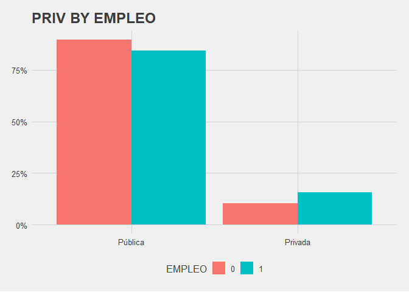

# Trabajo Fin de Grado

> _"Análisis del efecto del tipo de universidad sobre el empleo de los graduados españoles"_

Este repositorio contiene el código fuente y el texto final de mi trabajo de fin de grado junto con un documento markdown con un análisis 
exploratorio de la base de datos EILU que utilice para el mismo.

<!-- -->

## Sobre el proyecto
En este trabajo trato de cuantificar cuanto aumenta la probabilidad de estar empleado haber asistido a una universidad privada.  
Como se puede ver en el gráfico más arriba, es mayor el porcentaje de empleados entre aquellos que asistieron a la universidad privada.
Un hecho que se constata año tras año en las estadísticas de empleo. Por ello, mi propósito era tratar de esclarecer si asistir a una universidad 
privada realmente tiene un efecto genuino sobre la probabilidad estar empleado o se trata meramente de sesgo de selección. 
Desafortunadamente, los datos disponibles no permiten responder del todo a esta pregunta, pero los resultados parecen indicar que si existe causalidad.

## Datos
_Encuesta de inserción laboral de titulados universitarios. EILU. Año 2019_  

Los datos se encuentran disponibles en el [INE](https://www.ine.es/dyngs/INEbase/es/operacion.htm?c=Estadistica_C&cid=1254736176991&menu=resultados&idp=1254735976597#!tabs-1254736195339)
 y también los he compartido en [Kaggle](https://www.kaggle.com/antoniotello/eilu-descriptive-analysis-and-visualization/data).

## Inspiración

Cap.2 Regression from _Mastering 'Metrics: The Path from Cause to Effect_  
[Vídeo](https://www.youtube.com/watch?v=6YrIDhaUQOE&ab_channel=MarginalRevolutionUniversity)
